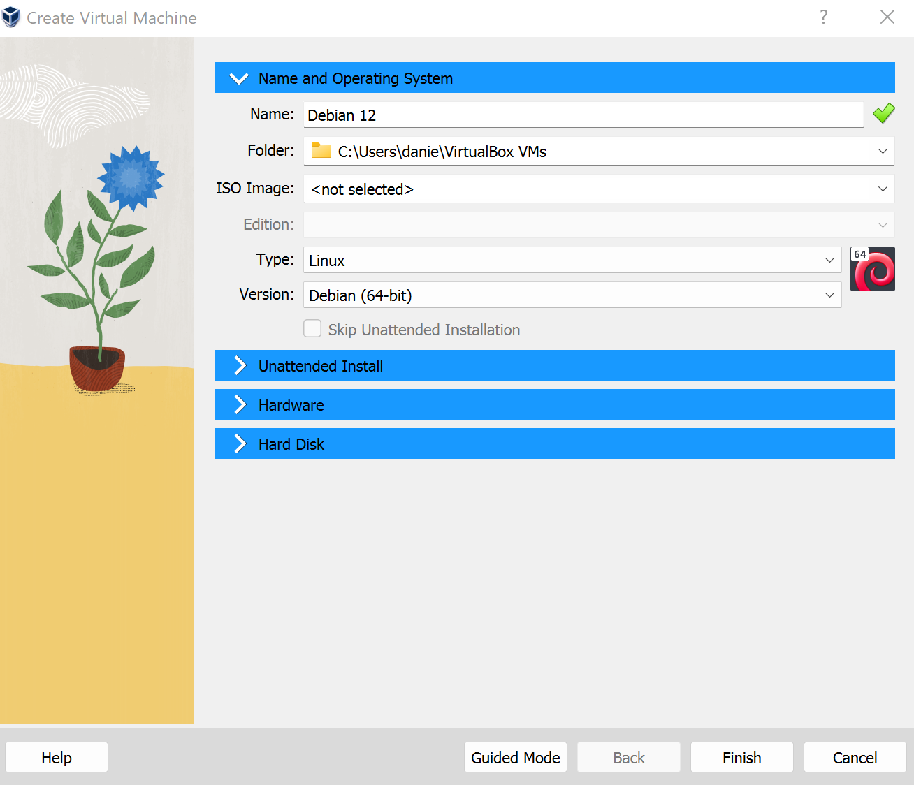
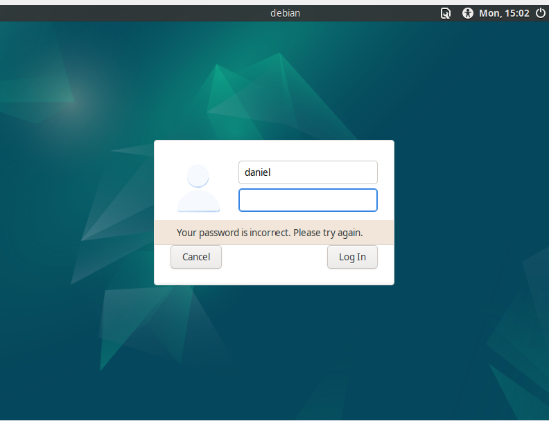
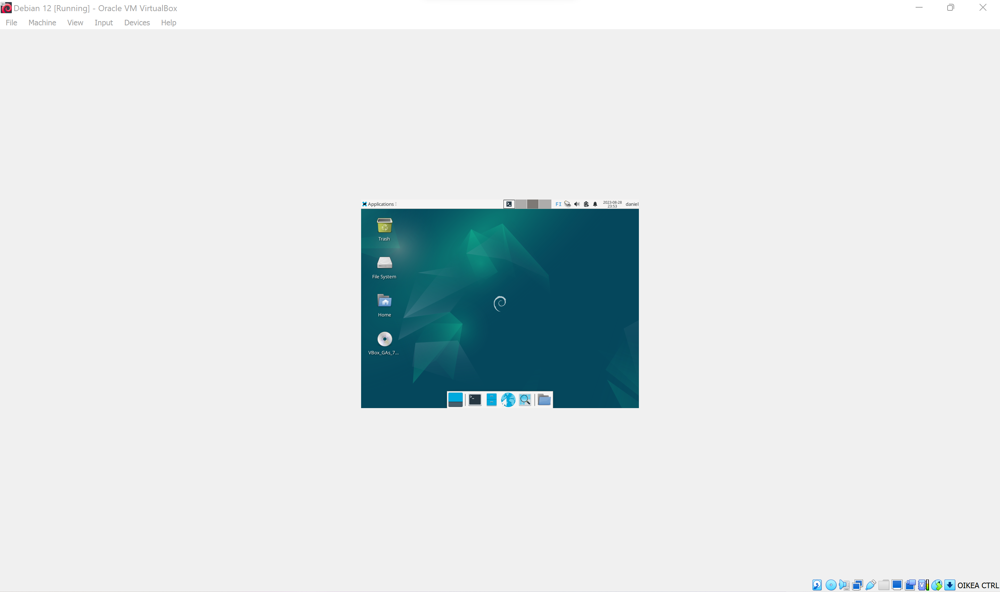

# H1 oma linux
## x) Tehtävän anto: lyhyt tiivistelmä siitä, että mikä on vapaa ohjelmisto. (eritoten neljä vapautta)

Kun puhutaan vapaa ohjelmistosta, niin sillä tarkoitetaan jotain tietokoneohjelmistoa, johon käyttäjällä on tietyt oikeudet. Ohjelmisto voi olla ilmainen tai maksullinen. Tässä neljä vapautta:

**Vapaus käyttää:** Käyttäjä voi käyttää ohjelmistoa mihin tahansa tarkoitukseen ilman rajotteita.

**Vapaus tutkia:** Käyttäjällä on oikeus päästä tutkimaan ohjelmiston lähdekoodia.

**Vapaus jakaa:** Käyttäjä voi kopioida, jakaa tai levittää ohjelmistoa eteenpäin. Maksua tai ilman maksua vastaan.

**Vapaus muokata:** Käyttäjä saa muokata lähdekoodia ja räätälöidä sen miten haluaa.

## a) Tehtävän anto: asenna Linux virtuaalikoneeseen.

Aloitin linuxin asentamisen lataamalla ensin virtualboxin ja luomalla uuden virtual machinen.

 

Tämän jälkeen latasin debian-live-12.1.0-amd64-xfce.iso tiedoston. Debian ladattua menin asetuksiin ja sieltä storageen. Storagesta sain liitettyä iso tiedoston, johon debian oltiin pakattu.

Sain käynnistettyä virtual machinen, jonka jälkeen jatkoin ohjeiden seuraamista. Pääsin linuxin desktopiin, josta pääsin asentamaan debiania. 

Debianin asennuksen jälkeen minulla tuli ensimmäinen ongelma vastaan, sillä en päässyt kirjautumaan sisään tehdyillä tunnuksilla.

Asensin debian uudestaan useaan kertaan, kunnes tajusin, että minun täytyi ensin kirjautua sisään -> Käyttäjätunnus "user", salasana "live" menetelmällä, jonka jälkeen pystyin kirjautumaan omilla debian tunnuksilla sisään.

Sain lopulta debian onnistuneesti asennettua, mutta yksi suuri ongelma minulta jäi ratkaisematta, vaikka koitin etsiä tietoa siihen. Ongelmani on, että virtual machinen näytön koko on todella pieni:

## Lähteet:
https://terokarvinen.com/2023/linux-palvelimet-2023-alkusyksy/#h1-virtuaali-linux

