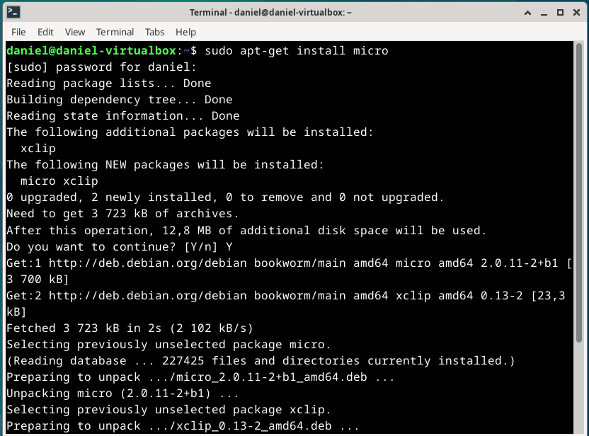
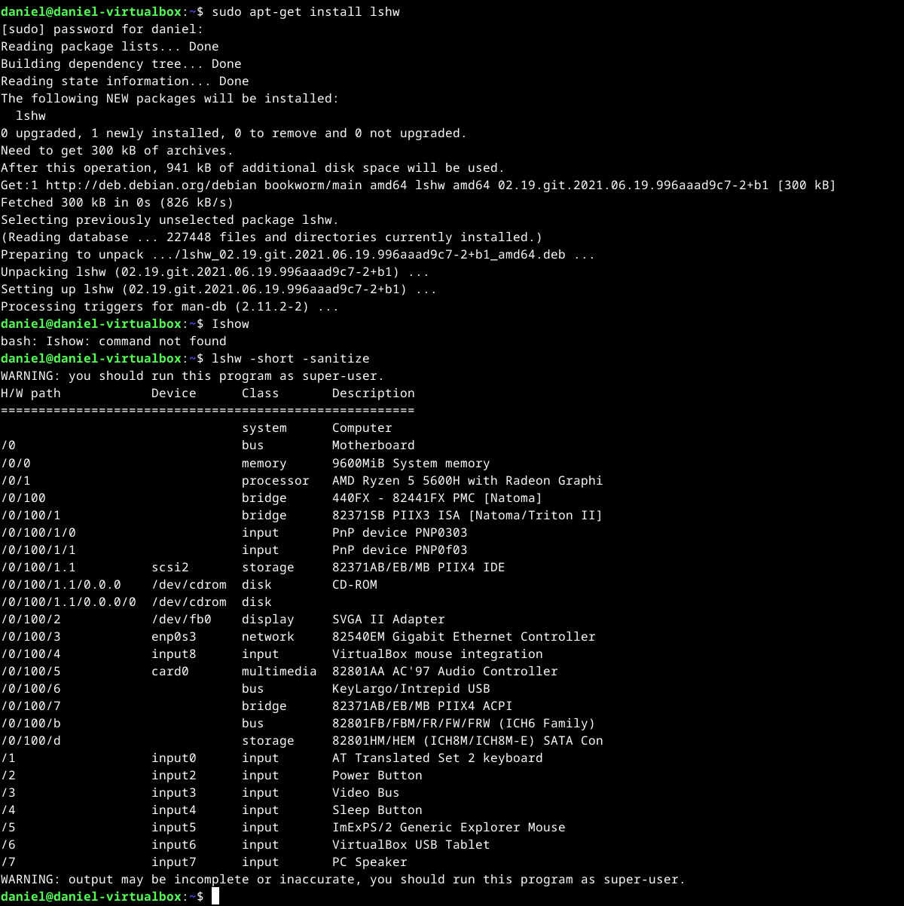
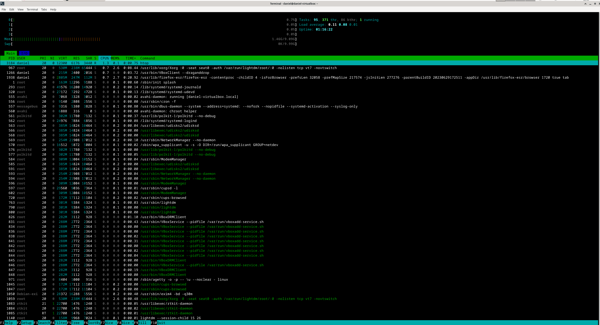
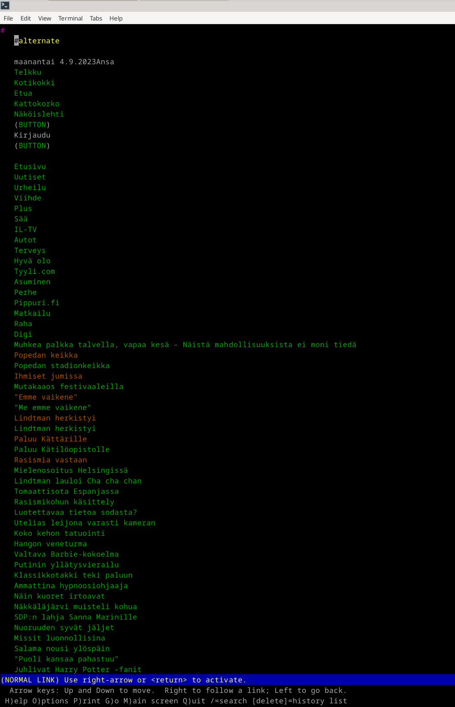
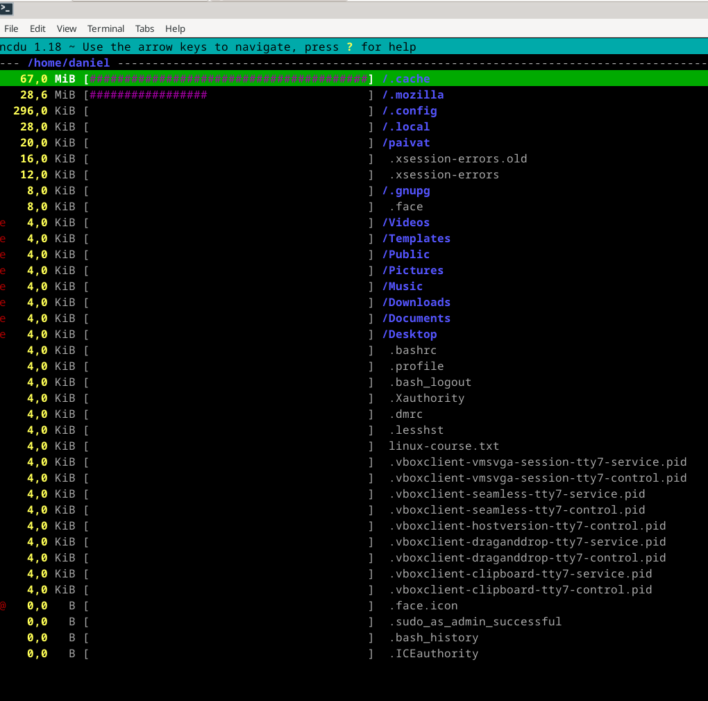
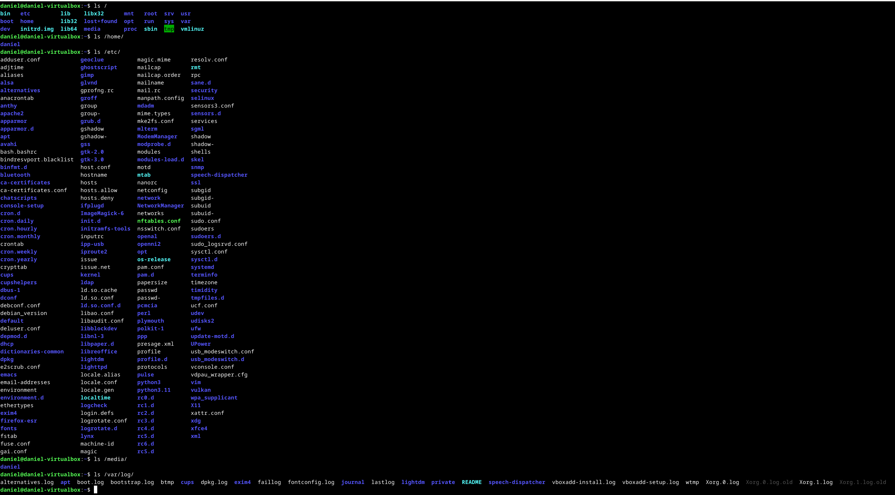
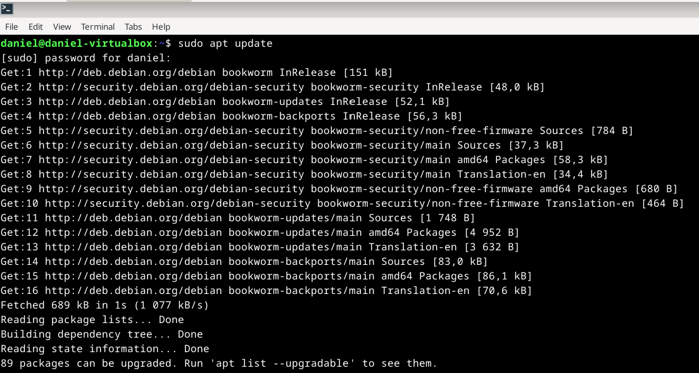
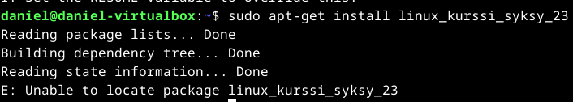

### Kaikki testit tehty käyttäen Yoga Slim 7 Pro 14ACH5, oracle virtualbox 7, Debian 12

# H2 Komentaja Pingviini
## x) Lue ja tiivistä: (Karvinen 2020: Command line basics revisited)
Tero Karvisen kirjoittama artikkeli käy hyvin läpi yleisimmät komennot, joita käytetään, kun kirjoitetaan komentoriville.
### Hakemisto komentoja:
- 'pwd': tämä tulostaa nykyisen työhakemiston
- 'ls':  tämä listaa tiedostot työhakemistossa.
- 'cd': tällä vaihdetaan hakemistoa toiseen.

Nämä kaikki liittyy navigointiin, joka on tärkeää komentoriviä käyttäessä.

### Muita hyödyllisiä komentoja:
- 'man': tällä komennolla saadaan laajemmat ohjeet. Esim man ls antaa kattavat ohjeet Is komennosta.
- 'sudo apt-get install': tällä saadaan asennettua eri ohjelmistopaketteja.

## a) Micro editorin asentaminen:
Microa on kevyt tekstieditori ja sen asentaminen oli todella yksinkertaista. 
### sudo apt-get install micro
Tällä komennolla sain micron asennettua.
 

Micron käyttäminen oli myös hyvin yksinkertaista. 
### micro linux-course.txt
Tällä komennolla sain luotua tekstitiedoston ja sen tallentaminen tapahtui painamalla Ctrl + S ja jos halusin pois editorista niin piti painaa Ctrl + Q.

## b) Rauta. Listaa testaamasi koneen rauta:
Komennolla lshw -short -sanitize saadaan luettelon laitteiston osista. Itse asensin ensiksi kyseisen ohjelmiston komennolla: sudo apt-get install lshw.
Tässä vielä kuva oman tietokoneen raudasta:
 

## c) Apt. Asenna kolme itsellesi uutta komentoriviohjelmaa:
Valitsin ensiksi itselleni kolme uutta komentoriviohjelmaa, jotka olivat:

Htop: tämän avulla voi seurata järjestelmän suorituskykyä.

 

Lynx: tekstipohjainen selain

 

En usko, että ainakaan itse kokisin hyötyä tästä, mutta ihan hauska kuitenkin.

Ncdu: levytilan analysointityökalu

Näistä kolmesta komentoriviohjelmasta minä pidin ncdu:ta eniten hyödyllisenä. Se helpottaa seuraamaan levytilan kulutusta, joka on omasta mielestä kätevää.

Asensin nämä kolme ohjelmaa samaan aikaa käyttmällä komentoa:
### sudo apt-get install htop lynx ncdu

## d) FHS:

Käytin testeissä:

- ls /
- ls /home/
- ls /etc/
- ls /media/
- ls /var/log/

Näillä sain luettelon kunkin hakemiston sisällöstä:

Jos halusin saada syvempää tietoa hakemistojen sisällöistä, niin pystyin tekemään sen kirjoittamalla esim: ls/home/daniel ja sain luettelon sen sisällöstä -> Desktop  Documents  Downloads  linux-course.txt  Music  paivat  Pictures  Public  Templates  Videos

## e) grep komennon käyttö:

grep komentoa voidaan käyttää esimerkiksi tällä tavalla: grep "linux" *.txt

Tällä komennolla saadaan haettua kaikista tekstitiedostoista "linux" sanan sisältävän tiedoston. Minun tapauksessa se löysi "linux-kurssi".

Voit tehdä myös kohdistetun haun suoraan tekstitiedostoon. Se tapahtuu seuraavasti: grep "linux" linux-course.txt

## f) Pipe. Näytä esimerkki putkista

Putkia voidaan käyttää esimerkiksi tällä tavalla: ls *.txt | sort

Tämä järjestää saadut tulokset aakkojärjestykseen. Minun tapauksessa se antoi seuraavat tulokset:

- linux-course.txt
- pingviini.txt
- tehtavat.txt

## g) Tukki

Tässä kaksi yksinkertaista esimerkkiä:

### Onnistunut:
sudo apt update  # Päivitä pakettilista

Tämän jälkeen voidaan viellä päivittää asennetut paketit:

sudo apt upgrade

### Epäonnistunut:
sudo apt-get install linux_kurssi_syksy_23

Vastaukseksi saatiin: E: Unable to locate package linux_kurssi_syksy_23

## Lähteet:
https://terokarvinen.com/2020/command-line-basics-revisited/?fromSearch=command%20line%20basics%20revisited

