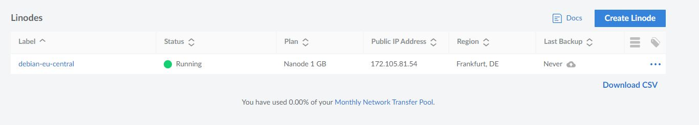

### Kaikki testit tehty käyttäen Yoga Slim 7 Pro 14ACH5, oracle virtualbox 7, Debian 12

# h4 Maailma kuulee
## x) Lue ja tiivistä: Karvinen 2012: First Steps on a New Virtual Private Server – an Example on DigitalOcean and Ubuntu 16.04 LTS
Artikkelissa käydään kaikki oleellinen läpi ja toimii hyvänä oppaana, kun halutaan perustaa virtuaalipalvelin (VPS), käyttäen DigitalOceania ja DNS-nimen määrittämiseen NameCheap-palvelua.
Artikkelissa korostetaa vahvojen salasanojen käytön tärkeyttä, eli aina pitää käyttää hyviä salasanoja, jotka eivät ole helposti murrettavissa. Github tarjoaa näitä palveluita koulutuspakettina opiskelijoille, jolla pääsee tutustumaan ilmaiseksi VPS:ään ja .me-verkkotunnukseen.

## a) Virtuaalipalvelimen hankkiminen ja asentaminen
Mietin pitkää, että mitä käyttäisin virtuaalipalvelimen luomiseen. Tarkoitus oli ensiksi käyttää DigitalCoeania, mutta en saanut githubilta vastausta minun education student packin hakemukseen. Päädyin valitsemaan Linoden, sillä se ei maksanut yhtään ja sai vielä $100.00 edestä creditejä.
Ainoa negatiivinen asia mitä sanoisin oli se, että kortin tiedot jäi sivulle, enkä voi niitä poistaa sieltä, joten pitää keksiä joku ratkaisu tuohon, sillä en mielelläni jätä sivustolle kortin tietoja pitkäksi aikaa.


Aloitin tosiaan valitsemalla Linode planin ja tähän hätään otin kaikista halvimman, eli tuon shared cpu:n ja nanode 1 GB.



Linode palvelin on nyt päällä ja seuraavaksi kirjaudun sisään palvelimeen rootina ja tarkistan samalla ip a komennolla, että olen yhteydessä Linoden palvelimeen:
### ssh root@172.105.81.54
### ip a


## b) Tee alkutoimet omalla virtuaalipalvelimellasi: tulimuuri päälle, root-tunnus kiinni, ohjelmien päivitys.
Aloitin luomalla tunnuksen omalla nimellä, jotta ei tarvitse rootilla kirjautua sisään:
### sudo adduser daniel
### ssh daniel@172.105.81.54 (ip osoite on Linoden palvelimesta)
Jouduin hieman kikkailemaan aluksi, sillä komentorivi valitti minulle seuraavaa "daniel is not in the sudoers file". Sain korjattua sen näin:
- Ensiksi menin --> ssh root@172.105.81.54
- Tarkistin, että onko käyttäjä daniel lisätty sudo-ryhmään --> groups daniel
- Tämän jälkeen --> usermod -aG sudo daniel
- Exit
Nyt pääsin tulimuuri vaiheeseen, jossa ensiksi käytin komentoa "sudo apt update" jonka jälkeen asensin ufw "sudo apt install ufw".

Kirjoitin komentoriville sudo ufw allow 22/tcp, joka teki aukon SSH:n.
### Rules updated
### Rules updated (v6)
Seuraavaksi laitoin tulimuurin päälle --> sudo ufw enable
### Firefall is active and enabled on system startup
Tämän jälkeen laitoin root tunnuksen kiinni:
```
$ sudo usermod --lock root
Disable root login on SSH

$ sudoedit /etc/ssh/sshd_config
    # ...
    PermitRootLogin yes --> no (tämä piti vaihtaa "no)
    # ...
$ sudo service ssh restart
```
Lopuksi tein:
### sudo apt-get update
### sudo apt-get upgrade

## c) Asenna weppipalvelin omalle virtuaalipalvelimellesi. Korvaa testisivu. Kokeile, että se näkyy julkisesti. Kokeile myös eri koneelta, esim kännykältä.
Aloitin kirjautumalla minun käyttäjälle ssh daniel@172.105.81.54, jonka jälkeen tein "sudo apt install apache2".

Tämän jälkeen menin Apache-verkkosivujen juurihakemistoon, joka on "cd /var/www/html". Juurihakemistossa on index.html oletustiedosto, jonka menin muokkaamaan komennolla: "sudo nano index.html".
Muokkasin nopeasti sivusta oman näköisen ja tämän jälkeen laitoin tulimuuri asetukset päälle:
### sudo ufw allow 80/tcp (Avasin palvelimen tulimuuriin portin 80.)
### sudo ufw enable

Tämän jälkeen sivustolle pitäisi päästä julkisesti: http://172.105.81.54/ (jos serveri on käynnissä).


Huomasin, että sivusto ei ole secure, mutta en saanut sitä ratkaistua.

## d) Etsi merkkejä murtautumisyrityksistä.
Omana palvelimena käytin Linodea, joka tarjoaa Cloud Firewall -palvelun. Tämän avulla voidaan valvota verkkoliikennettä ja myös lisätä sääntöjä, jotka estävät liikennettä tietyistä IP-osoitteista tai porteista.

Testatsin myös journalctl komentoa, jolla voidaan tarkastella palvelinlokeja esim. kirjautumisyrityksiltä.


## Lähteet:
First Steps on a New Virtual Private Server – an Example on DigitalOcean and Ubuntu 16.04 LTS, Tero Karvinen. [https://terokarvinen.com/2008/05/02/install-apache-web-server-on-ubuntu-4/](https://terokarvinen.com/2017/first-steps-on-a-new-virtual-private-server-an-example-on-digitalocean/)https://terokarvinen.com/2017/first-steps-on-a-new-virtual-private-server-an-example-on-digitalocean/ Luettu 18.9.2023
