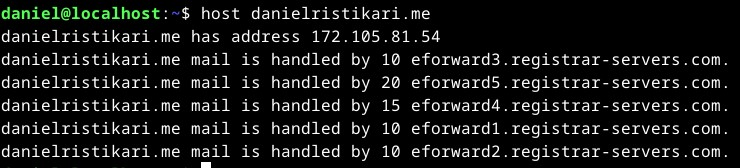

### Kaikki testit tehty käyttäen Yoga Slim 7 Pro 14ACH5, oracle virtualbox 7, Debian 12
Processor: AMD Ryzen™ 5 5600H (6C / 12T, 3.3 / 4.2GHz, 3MB L2 / 16MB L3)

Graphics: Integrated AMD Radeon™ Graphics

Chipset: AMD SoC Platform

Memory: 16GB Soldered DDR4-3200

Memory Slots: Memory soldered to systemboard, no slots, dual-channel

Max Memory :16GB soldered memory, not upgradable

Storage: 512GB SSD M.2 2280 PCIe® 3.0x4 NVMe®

# h5 Nimittäin

## x) Lue ja tiivistä: 
### New Default Website with Apache2 – Show your homepage at top of example.com, no tilde

Apache2 asennus:
```
$ sudo apt-get update
$ sudo apt-get -y install apache2
```
Apachesta on hyvä tietää se, että se voi pyörittää useaa virtuaalipalvelinta samanaikaisesti ja ne pystytään määritellä polussa "http://etc/apache2/sites-available/"

Uusi virtuaalipalvelin voidaan luoda seuraavasti:

Esimerkki: sudoedit /etc/apache2/sites-available/daniel.conf 
```
<VirtualHost *:80>
  DocumentRoot /home/daniel/public_html/
  <Directory /home/daniel/public_html/>
    Require all granted
  </Directory>
</VirtualHost>
```
Se saadaan otettua käyttöön seuraavalla komennolla: "sudo a2ensite tero.conf"

Nyt voidaan siirtyä kotisivun luomiseen:
```
Kotihakemistoon siiryminen tapahtuu "cd" komennolla.
Public_html-hakemisto: mkdir public_html/
Siirtyminen sinne tapahtuu: cd public_html/
Lopuksi luodaan index.html --> muokkaamiseen voidaan käyttää nano komentoa, eli "nano index.html".
Nyt voidaan mennä kotisivuille localhostin kautta ja se voidaan validoida sivulla: https://validator.w3.org/
```

### Name Based Virtual Hosts on Apache – Multiple Websites to Single IP Address
Käytännössä sama logiikka kuin edellisessä artikkelissa.

Lisäämällä rivejä "sudoedit /etc/hosts", nimipalveluida voidaan tällä simuloida.
### Name-based Virtual Host Support
- IP-pohjaisessa virtuaalipalvelussa jokaiselle palvelimelle tarvitaan oma IP-osoite, kun taas nimipohjaisessa virtuaalipalvelussa useat eri palvelimet voivat jakaa saman IP-osoitteen.
- Palvelimelle saapuvat pyynnöt käsitellään ensin IP-osoitteen ja portin perusteella, sitten verrataan ServerName- ja ServerAlias-ohjeita.

## a) Domain-nimi  
Ensiksi menin NameCheap sivustolle ja vuokrasin itselleni domain-nimen. Github education tarjoaa vuodeksi ilmaisen domainin, joten hyödynsin tämän tarjouksen.


Seuraavaksi siirryin NameCheap sivun Advanced DNS -välilehdelle, jossa pystyin lisätä kaksi uutta recordia. Lisäsin www & @ ja annoin niille IP-osoitteen ja samalla TTL (time to live)-ajaksi 1-min.


Kuvasta huomaa, että käytin samaa IP-osoitetta, joka löytyy Linoden palvelimesta:


Tämän jälkeen tein kaikki muutokset mitä tein myös viime viikon tehtävässä "[h4 Maailma kuulee](https://github.com/Eviix/linux-course/blob/main/h4%20Maailma%20kuulee.md)".

Aivan alkuun kirjauduin viime viikolla tehtyyn käyttäjään --> ssh daniel@182.105.81.54 ja tein tarvittavat toimenpiteet palvelimen luomiseen:
```
sudo apt-get update
sudo apt-get install ufw apache2 
```
Tämän jälkeen tein porttien avauksen SSH:ta ja HTTP:tä varten, sekä laitoin palomuurin päälle:
```
sudo ufw allow 22/tcp
sudo ufw allow 80/tcp 
sudo ufw enable
```

index.html, jonka loin viime viikon tehtävässä pitäisi nytten toimia domain-nimellä:


## b) host- ja dig-analyysi

En ollut ennen perehtynyt host ja dig komentoihin, joten aivan alkuun käytin man host & man dig komentoa. Lyhyesti voitaisi sanoa, että niitä käytetään domain-nimen ja niiden DNS-tietojen tarkasteluun ja kyselyyn.

Ensiksi kokeilin host komentoa:
```
host danielristikari.me
```
Sain ainakin selville, että mitä IP-osoitetta danielristikari.me sivusto käyttää, sekä sähköpostipalvelimien osoitteita.



Seuraavaksi kokeilin dig komentoa:

```
dig danielristikari.me
```
Sain tästä ainakin selville sen, että IP-osoite on 172.105.81.54 ja Kysely kesti 8 millisekuntia. Tajusin myös sen, että se suoritettiin palvelimelta "139.162.130.20", jossa käytettiin UDP-protokollaa. NOERROR liittyi siihen, että kyselyssä ei tullut mitään virheitä.


## c) Etusivu uusiksi


## Lähteet:
Karvinen 2016: https://terokarvinen.com/2016/02/16/new-default-website-with-apache2-show-your-homepage-at-top-of-example-com-no-tilde/ Luettu 24.9.2023
Karvinen 2018: https://terokarvinen.com/2018/04/10/name-based-virtual-hosts-on-apache-multiple-websites-to-single-ip-address/ Luettu 24.9.2023
Apache Software Foundation 2023: https://httpd.apache.org/docs/2.4/vhosts/name-based.html Luettu 24.9.2023
https://www.namecheap.com/


