### Kaikki testit tehty käyttäen Yoga Slim 7 Pro 14ACH5, oracle virtualbox 7, Debian 12
Processor: AMD Ryzen™ 5 5600H (6C / 12T, 3.3 / 4.2GHz, 3MB L2 / 16MB L3)

Graphics: Integrated AMD Radeon™ Graphics

Chipset: AMD SoC Platform

Memory: 16GB Soldered DDR4-3200

Memory Slots: Memory soldered to systemboard, no slots, dual-channel

Max Memory :16GB soldered memory, not upgradable

Storage: 512GB SSD M.2 2280 PCIe® 3.0x4 NVMe®

# h6 DJ Ango

## x) Lue ja tiivistä: 
### Karvinen 2023: Python Web - Idea to Production - 2023

- Python weppipalvelu - ideasta tuotantoon toteutuksella pääsee rakentamaan weppipalvelu Pythonilla ja myös asentamaan sen julkiselle palvelimelle.
- Se pystyy palvelemaan asiakkaita usealla eri laitteella moiteettomasti.
- Käyttäjien ei tarvitse asentaa mitään.
- Yhtäaikainen muokkas mahdollisuus käyttäjillä.
- Aina uusin versio automaattisesti käytössä.

### Karvinen 2022: Django 4 Instant Customer Database Tutorial

- Opitaan luomaan asiakastietokannan web-käyttöliittymällä käyttäen Django 4.
- Aluksi tehdään kehitysympärtön asennukset: asennetaan virtualenv: sudo apt-get -y install virtualenv,
luodaan virtuaaliympäristö: virtualenv --system-site-packages -p python3 env/ ja lopuksi aktivoidaan virtuaaliympäristö: source env/bin/activate
- Asennetaan Django, tämän jälkeen päästään luomaan uusi projekti, jonka jälkeen voidaan käynnistää kehityspalvelin seuraavasti --> ./manage.py runserver
- Tässä vaiheessa voidaan siirtyä admin-käyttöliittymän asennukseen, joka onnistuu seuraavasti --> avataann admin-käyttöliittymä: http://127.0.0.1:8000/admin/, päivitetään kaikki tietokannat: ./manage.py makemigrations ja ./manage.py migrate ja lopuksi luodaan superkäyttäjä ./manage.py createsuperuser.
- Lopuksi voidaan luoda uusia käyttäjiä ja asiakastietokantoja.

### Karvinen 2022: Deploy Django 4 - Production Install

- Opitaan julkaisemaan Python Djangolla luotuja verkkosovelluksia internetissä oikealla tuotantopalvelimella Apache 2.4:llä ja mod_wsgi:n avulla.
- Vaaditaan, että perustaidot terminaalinkäytöstä on hallussa.

### a) Asenna Django-kehitysympäristö

- Aloitin tehtävän seuraamalla Teron tehtyjä ohjeita, jotka löytyvät https://terokarvinen.com/2022/django-instant-crm-tutorial/
- Ohjeiden lukemisen jälkeen tein ensimmäisen toimeenpiteen, eli latasin Djangon:
```
$ sudo apt-get -y install virtualenv
$ virtualenv --system-site-packages -p python3 env/
```

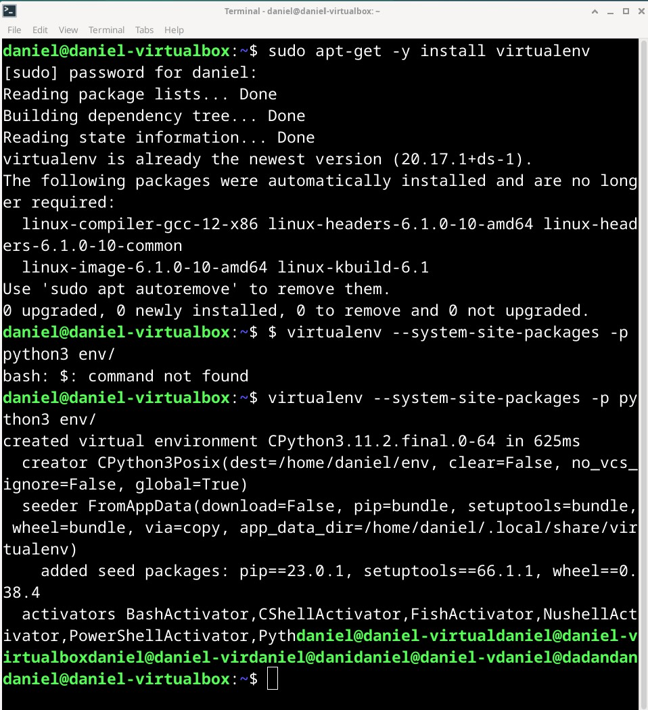

- Tässä vaiheessa on hyvä tietää, että pipiä ei kannata käyttää sudo-komennon kanssa, sillä se voi aiheuttaa turvallisuusongelmia ja käyttöoikeusongelmia.  
- Nyt voimme siirtyä uuteen virtuaaliympäristöön ja tehdä sen sisällä tarvittavat asennus toimenpiteet:
```
$ source env/bin/activate
$ which pip /home/daniel/env/bin/pip
```
- Python-paketin lisääminen tekstitiedostoon, sisällön lataaminen ja version tarkastaminen:
```
$ micro requirements.txt
$ cat requirements.txt

$ pip install -r requirements.txt
$ django-admin --version
```
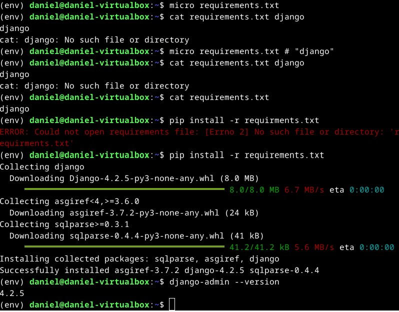

Nyt voimme kokeilla toimiiko django seuraavasti:
```
$ django-admin startproject daniel

$ cd daniel
$ ./manage.py runserver
```
- Lopuksi menemme --> http://127.0.0.1:8000/
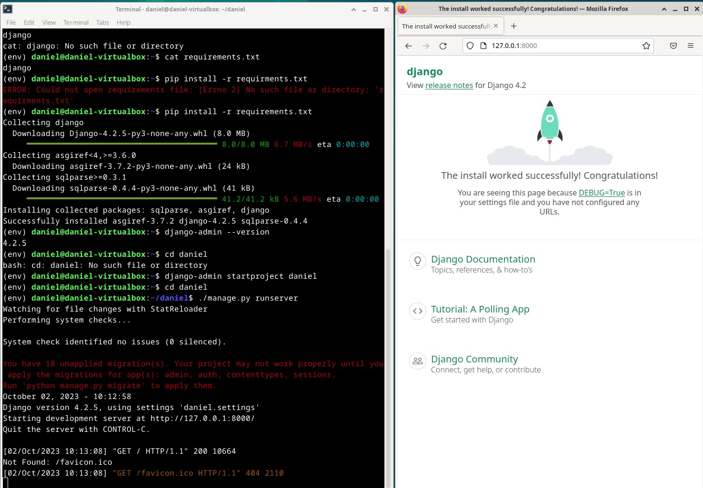

### b) esimerkkitietokanta ja Django admin-liiyymä

- Jatkoin tehtävää tekemällä ensiksi päivitykset tietokantaan:
```
$ ./manage.py makemigrations
$ ./manage.py migrate
```
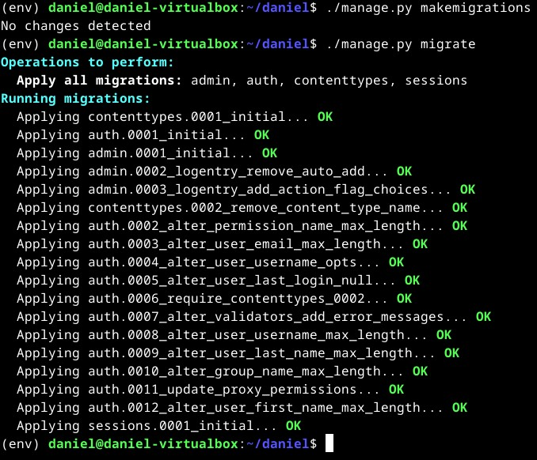

- Seuraavaksi lähdin lisäämään käyttäjää (superkäyttäjä):
```
$ ./manage.py createsuperuser 
```
- Täytin tarvittavat tiedot käyttäjälle ja loin sen, jonka jälkeen pystyin kirjautumaan sisään -> http://127.0.0.1:8000/admin/
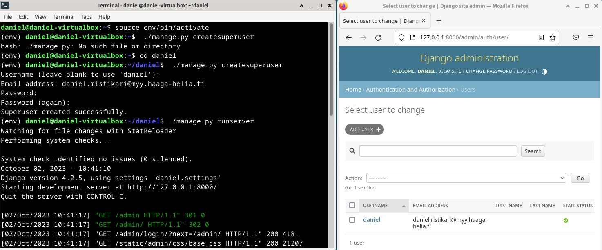

- Seuraavaksi vuorossa on asiakastietokannan luominen:
```
## Aloitetaan luomalla crm/ kansio
$ ./manage.py startapp crm
## 'crm' rivin lisääminen
$ micro daniel/settings.py
```
- Modelien lisäys:
```
$ micro crm/models.py
from django.db import models

class Customer(models.Model):
   name = models.CharField(max_length=300)
```
- Tehdään migraatiot:
```
$ ./manage.py makemigrations
$ ./manage.py migrate
```
- Loput admin muutokset:
```
$ micro crm/admin.py
from django.contrib import admin
from . import models

admin.site.register(models.Customer)
```
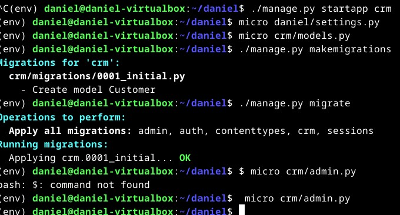

- Voimme nyt käynnistää serverin ja nähdä uusi customer model adminissa 
```
$ ./manage.py runserver
```
- Asiakkaan lisämisen jälkeen näkymä näyttää tältä:
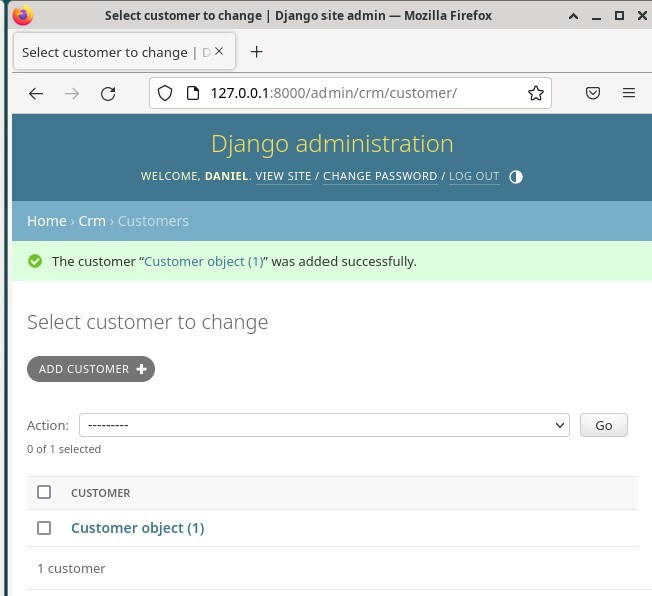

### c) Tee Djangon tuotantotyyppinen asennus omalle, paikalliselle virtuaalikoneellesi.

- Luettuani artikkelin "Deploy Django 4 - Production Install", pääsin vihdoin aloittamaan seuraavan tehtävän.
- Seurasin ohjeita ja loin alkuun pientä web sisältöä testausta varten:

```
$ cd
$ mkdir -p publicwsgi/daniel/static/
$ echo "hello world"|tee publicwsgi/daniel/static/index.html hello world
```
- Tämän jälkeen loin uuden virtualhostin seuraavasti:
```
$ sudoedit /etc/apache2/sites-available/daniel.conf
```
```
<VirtualHost *:80>
	Alias /static/ /home/daniel/publicwsgi/daniel/static/
	<Directory /home/daniel/publicwsgi/daniel/static/>
		Require all granted
	</Directory>
</VirtualHost>
```
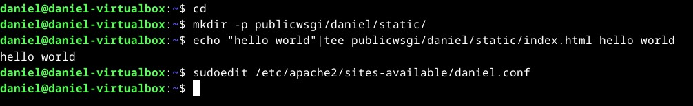

- Seuraavaksi laitoin päälle uuden sivun ja muut pois päältä:
```
$ sudo a2ensite teroco.conf
$ sudo a2dissite 000-default.conf 
```
- Testasin myös configurea ja tarkistin, että kaikki toimii:
```
$ /sbin/apache2ctl configtest
```
- Lopuksi käynnistin apache2 uudelleen:
```
sudo systemctl restart apache2
```
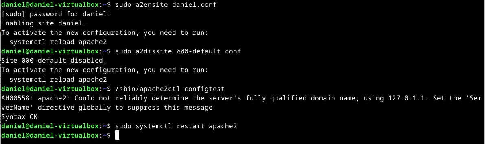

- Aivan lopuksi testasin, että minulla on pääsy static tiedostoihin:

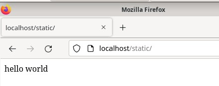

### Djangon liittäminen

- Hyödynnän aiempaa luotua Django-projektia ja lähden alkuun muokkaamaan VirtualHost configia käyttämällä Teron templateaw:
```
$ sudoedit /etc/apache2/sites-available/daniel.conf
```
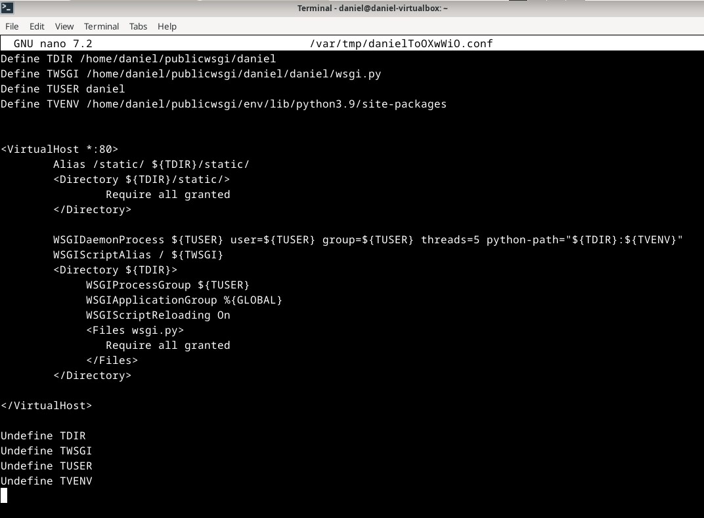

- Seuraavaksi Apache2 WSGI moduulin asennus:
```
$ sudo apt-get -y install libapache2-mod-wsgi-py3
```
- Tehdään config testit ja tarkistetaan toimiiko se:
```
$ /sbin/apache2ctl configtest
```
- Apache2 uudelleen käynnistäminen:
```
sudo systemctl restart apache2
```
- Lopuksi tarkistetaan mitä tapahtuu:
```
curl -s localhost|grep title
```
- Seurasin ohjeita step by step, mutta silti jostain syystä minulle tuli 403 forbidden:

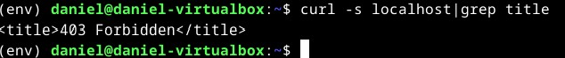

- Koitan saada tunnin aikana tämän selvitettyä, jos jollain muilla sattuisi olemaan sama errori.

## Lähteet:
Karvinen 2023: https://terokarvinen.com/2023/python-web-idea-to-production/#osaamistavoitteet/ Luettu 02.10.2023

Karvinen 2022: https://terokarvinen.com/2022/django-instant-crm-tutorial/ Luettu 02.10.2023

Karvinen 2022: https://terokarvinen.com/2022/deploy-django/ Luettu 02.10.2023
