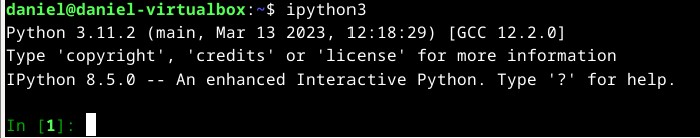
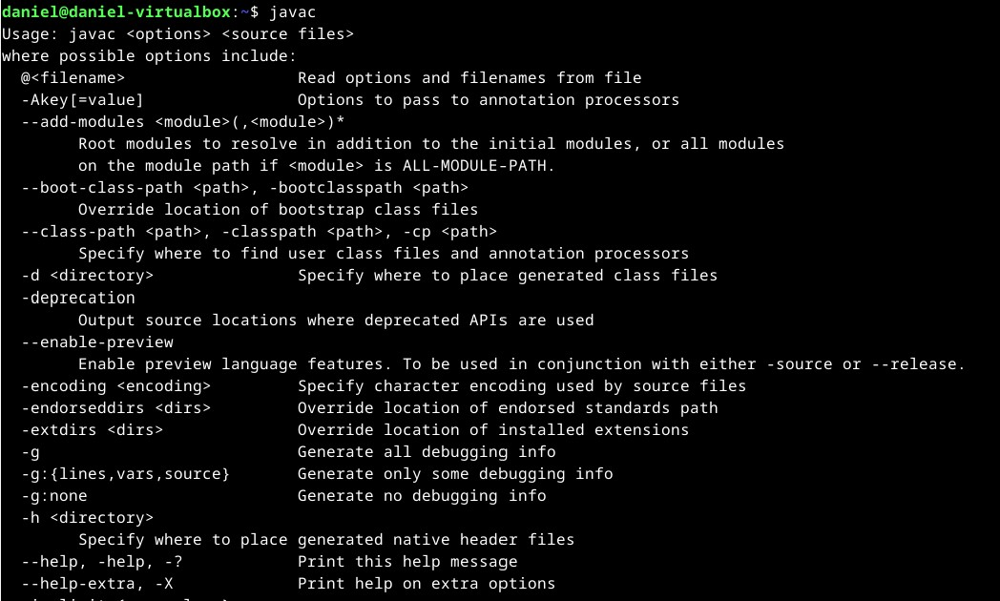
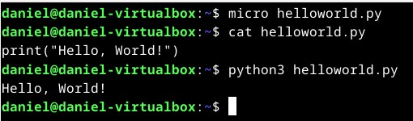
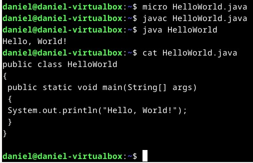

### Kaikki testit tehty käyttäen Yoga Slim 7 Pro 14ACH5, oracle virtualbox 7, Debian 12
Processor: AMD Ryzen™ 5 5600H (6C / 12T, 3.3 / 4.2GHz, 3MB L2 / 16MB L3)

Graphics: Integrated AMD Radeon™ Graphics

Chipset: AMD SoC Platform

Memory: 16GB Soldered DDR4-3200

Memory Slots: Memory soldered to systemboard, no slots, dual-channel

Max Memory :16GB soldered memory, not upgradable

Storage: 512GB SSD M.2 2280 PCIe® 3.0x4 NVMe®

# h7 Hello world

## x) Kaikki läksyt tähän

- Viikko 1: https://github.com/Eviix/linux-course/blob/main/h1-oma-linux.md
- Viikko 2: https://github.com/Eviix/linux-course/blob/main/h2%20Komentaja%20Pingviini.md
- Viikko 3: https://github.com/Eviix/linux-course/blob/main/h3%20Hello%20Web%20Server.md
- Viikko 4: https://github.com/Eviix/linux-course/blob/main/h4%20Maailma%20kuulee.md
- Viikko 5: https://github.com/Eviix/linux-course/blob/main/h5%20Nimitt%C3%A4in.md 
- Viikko 6: https://github.com/Eviix/linux-course/blob/main/h6%20DJ%20Ango.md

## y) Lue ja tiivistä

### Karvinen 2018: Hello World Python3, Bash, C, C++, Go, Lua, Ruby, Java – Programming Languages on Ubuntu 18.04

- "Hello, World!" on yksinkertainen ohjelma ja se on yleensä ensimmäinen asia, joka opetetaan millä tahansa ohjelmointikielellä ja sillä saadaan testattua myös, että ohjelmointiympäristö toimii oikein.
- Toimiva Hello, World! muutamalla eri ohjelmointikielellä:

Python3:
````
$ cat hellotero.py
print("Hello Tero")
$ python3 hellotero.py
Hello Tero
````
Bash:
````      
$ cat hellotero.sh
echo "Hello Tero"
$ bash hellotero.sh
Hello Tero
````
C:
````
$ cat hellotero.c
#include <stdio.h>
int main()
{
printf("Hello Tero\n");
}
$ gcc hellotero.c -o helloteroc
$ ./helloteroc
Hello Tero
````
- Tästä voidaan nopeasti päätellä, että Python3 ja Bash vaatii vähemmän riviä koodia kuten esim. C.

Lähde: Karvinen 2018: https://terokarvinen.com/2018/hello-python3-bash-c-c-go-lua-ruby-java-programming-languages-on-ubuntu-18-04/ Luettu 08.10.2023

## a) Käännä "Hei maailma" Pythonilla, Javalla ja C-kielellä.

- Lähdin tekemään tehtävää ensiksi komennolla: ````$ sudo apt-get update````, jotta kaikki paketit olisivat ajan tasalla.
- Asensin alkuun ohjelmistöympäristön, joka tukee python3 ja javaa ````$ sudo apt-get install -y ipython3 openjdk-17-jdk```` sillä sitä ei ole sisäänrakennettu linuxiin toisin kuin C.
- Asennus oli melko laaja ja siinä meni itselläni hetki, mutta asennuksen jälkeen sain käynnistettyä sen ````$ ipython3````

- Testasin vielä, että javan ohjelmistoympäristö asentui ````$ javac````


- Nyt päästään varsiniaseen tehtävään. Kokeilin ensiksi pythonilla, että miten hello world toimii. Käytin micro tekstieditoria ja loin sillä helloworld.py nimisen tiedoston ````($ micro helloworld.py)````.
````
$ cat helloworld.py
------------------
print("Hello, World!")
------------------
$ python3 helloworld.py
Hello, World!
````


- Seuraavana vuorossa javan kokeilu ````($ micro HelloWorld.java)````:
````
$ cat HelloWorld.java
------------------   
public class HelloWorld
{
 public static void main(String[] args)
 {
 System.out.println("Hello, World!");
 }
}
------------------
$ javac HelloWorld.java
$ java HelloWorld   
Hello, World!
````

- Lopuksi siirryin C:n kokeiluun ````($ micro helloworld.c)````:
 ````
$ cat helloworld.c
------------------
#include <stdio.h>
int main()
{
  printf("Hello, World!\n");
}
------------------
$ gcc helloworld.c -o helloworldc 
$ ./helloworldc
Hello, World!
````
